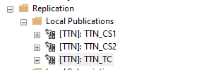

# [Thi trắc nghiệm](#ecommerce-shop) <a id="ecommerce-shop"></a>

## [Table of Contents](#table-of-contents) <a id="table-of-contents"></a>

- [Tables of Contents](#table-of-contents)

- [Instruction](#introduction)

- [Structure](#structure)

- [Featured](#feature)

- [Prerequisites](#prerequisites)

- [Utilization](#utilization)

- [Contributors](#contributors)

- [Problems and suggestions](#problems-and-suggestions)

## [Introduction](#introduction) <a id="introduction"></a>

- Đây là đồ án cuối kì môn "Cơ sở dữ liệu phân tán" của thầy Lưu Nguyễn Kỳ Thư trường PTITHCM (Học viên Công nghệ Buu chính Viễn thông tại cơ sở tại Thành phố Hồ Chí Minh).

- Ban đầu nhóm mình làm đồ án này bằng app, nhưng có 1 số vấn đề về mặt giao diện (style cho các table, button,...) nếu làm thì khá là tốn công sức đi nghiên cứu nên nhóm mình quyết định chuyển sang dùng web.

- Mục đích:

	1. Hiểu hệ thống phân tán.
	
	2. Thiết kế Kiến trúc có thể mở rộng.
	
	3. Triển khai phân chia dữ liệu.
	

## [Structure](#structure) <a id="structure"></a>

    

## [Features](#feature) <a id="feature"></a>

- Giảng viên:

	- Thêm, xóa, cập nhật ngân hàng câu hỏi của mình.
	
	- Có thể làm trước bài kiểm tra cho kỳ thi đó nhưng không tính điểm.

- Giảng viên nắm quyền cơ sở:

	- Quản lý thông tin giảng viên, nhân viên, sinh viên, lịch thi,... tại cơ sở tương ứng.
	
	- Tạo báo cáo danh sách điểm của sinh viên, danh sách đăng ký thi theo một khoảng thời gian.
	
- Giảng viên thuộc quyền trường:

	- Theo dõi, tạo báo cáo của của cả 2 cơ sở.
	
	- Được xem các thông tin như khoa, lớp, trường... nhưng không thể thao tác với dữ liệu đó.

- Sinh viên:

	- Xem danh sách các bài thi chưa thi, đã từng thi và không thi của chính mình.
	
	- Tham gia thi và được tính điểm.
	
	- Xem lại bài thi và kết quả chi tiết.

## [Prerequisites](#prerequisites) <a id="prerequisites"></a>

1. [Download SQL Server Management Studio (SSMS) 20.1](https://aka.ms/ssmsfullsetup)

2. [Download SQL Server 2022 (Deverlopber)](https://go.microsoft.com/fwlink/p/?linkid=2215158&clcid=0x409&culture=en-us&country=us)

3. [Download Python](https://www.python.org/downloads/)

## [Utilization](#utilization) <a id="utilization"></a>

1. Đầu tiên bạn cần phải đảm bảo đã tải đầy đủ các tài nguyên cần thiết [ở đây](#prerequisites).

2. [Cấu hình phân tán](./doc/Configure-Distribution/README.md):

3. Tạo link và database.

    - Tạo database mới với tên: **TTN**

    - Tạo LINK0 tại Server gốc -> chính nó. ([Hướng dẫn tạo link](./doc/Create-Linked-Servers/README.md))

    - Mở file sql [TTN_1](./TTN_1.sql) và chạy.

4. Phân tán: 

    Tạo ra 3 server:

    - Server 1: [TTN_CS1](./doc/Create-new-Publication/README-TTN-CS1.md)

    - Server 2: [TTN_CS2](./doc/Create-new-Publication/README-TTN-CS2.md)

    - Server 3: [TTN_TC](./doc/Create-new-Publication/README-TTN-TC.md)

        

    - Sau đó ta đẩy xuống các site tương ứng: 

5. [Phân quyền](./doc/Authorize/README.md)

6. Clone repo này về.

    ```bash
    git clone 
    cd testify
    ```

7. Tải các package cần thiết.

    ```bash
    pip install --upgrade pip
    pip install -r requirements.txt
    ```

8. Cấu hình lại project.

    - Mở file [/base/views.py](./base/views.py).

    - SERVER_LIST: Tên server của bạn.

    - PASSWORD: Mật khẩu server của bạn.

9. Chạy project:

    ```bash
    python manage.py runserver
    ```

## [Contributors](#contributors) <a id="contributors"></a>

<table>
    <tr>
        <th>Name</th>
        <th>Avatar</th>
        <th>Link Github</th>
        <th>Effect</th>
    </tr>
    <tr>
        <td>Nguyễn Thị Huyền My</td>
        <td></td>
        <td><a href="https://github.com/huyenmy239">huyenmy239</a></td>
        <td>
            <ul>
                <li>Thành viên có mặt rất năng suất, nhưng hay tạo ra những cái bug oái ăm, rất đáng bị ăn đòn.</li>
            </ul>
        </td>
    </tr>
    <tr>
        <td>Vũ Thị Thanh Thùy</td>
        <td></td>
        <td><a href="https://github.com/thanhthuyne2211">thanhthuyne2211</a></td>
        <td>
            <ul>
                <li>Thành viên có mặt mang tính chất đủ team, tạo tiếng cười.</li>
                <li><div style="width:480px"><iframe allow="fullscreen" frameBorder="0" height="480" src="https://giphy.com/embed/5l4m6iKzuMVqjGdER8/video" width="480"></iframe></div></li>
            </ul>
        </td>
    </tr>
    <tr>
        <td>Nguyễn Tấn Nguyên</td>
        <td></td>
        <td><a href="https://github.com/KonstanNguyen">KonstanNguyen</a></td>
        <td>
            <ul>
                <li>Thành viên bị 2 thành viên còn lại căm ghét, đòi đánh đập, hành hạ, sỉ vả.</li>
            </ul>
        </td>
    </tr>
</table>

## [Problems and suggestions](#problems-and-suggestions) <a id="problems-and-suggestions"></a>

- Problems:

	- Python nói chung và Django nói riêng hỗ trợ khá tốt ở các database khác nhưng về SQL Server thì có phần hơi hạn chế nên cần phải cân nhắc.
	
	- Django không phù hợp với Cơ sở dữ liệu phân tán trên SQL Server. Vì Django ORM khi ánh xạ với các bảng và khi connect với một server phân mảnh
	thì lúc truy vấn, dữ liệu sẽ ưu tiên trả về dữ liệu ở server gốc.
	
	- Database ban đầu của thầy gửi cho tụi mình có thiếu một số bảng (table) và một vài trường (field) gây ra việc có vài tính năng không thể xử lý được.
	
- Suggestions:

	- Nhóm mình dùng pyodbc để connect với server thay thế cho việc configure DATABASE sẵn có trong file `settings.py` của Django. Tự tạo model thay vì dùng
	Django ORM để ánh xạ với các bảng trong Cơ sở dữ liệu.
	
	- Cân nhắc bổ sung field, xóa, thay đổi cho thích hợp với nhu cầu của bạn. Đây là 1 số thay đổi của nhóm mình:
	
		- Thêm bảng CT_BAITHI(MABT, CAUHOI, TRALOI).
		
		- Thêm field TGCL (thời gian còn lại) vào bảng BAITHI.
		
		- Ngoài ra bạn có thể cân nhắc về việc thay đổi kiểu dữ liệu của MABT(ở bảng BAITHI). Nhưng vì nhóm đã phân tán xong
		nên việc thay đổi rất khó khăn nên nhóm vẫn quyết định giữ lại một số thứ, chi tiết bạn có thể xem file đã phân tán [tại đây]().
		