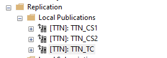

# [Multiple-choice Examination System]

## [Table of Contents](#table-of-contents)

- [Tables of Contents](#table-of-contents)

- [Instruction](#introduction)

- [Features](#features)

- [Prerequisites](#prerequisites)

- [Utilization](#utilization)

- [Contributors](#contributors)

- [Problems and suggestions](#problems-and-suggestions)

## [Introduction](#introduction)

- This project is the final course assignment for the subject “Distributed Databases”, instructed by Mr. Lưu Nguyễn Kỳ Thư at Posts and Telecommunications Institute of Technology – Ho Chi Minh City Campus (PTITHCM).

- Initially, the team developed this project as a desktop application. However, due to UI-related issues (styling tables, buttons, etc.) that required significant effort, the team decided to switch to a web-based solution.

- Objectives of the project:

	1. Understand distributed systems.
	
	2. Design a scalable architecture.
	
	3. Implement data fragmentation and distribution.
	

## [Features](#features)

- Lecturer:

	- Add, delete, and update their own question banks.
	
	- Preview an exam before the official test without recording scores.

- Branch-level Lecturer (Campus Authority):

	- Manage lecturers, staff, students, exam schedules, etc. within the assigned campus.
	
	- Generate reports on student scores and exam registrations within a specific time range.
	
- University-level Lecturer (School Authority)

	- Monitor and generate reports for both campuses.
	
	- View information such as faculties, classes, and campuses, but without permission to modify data.

- Student:

	- View lists of upcoming exams, completed exams, and missed exams.
	
	- Participate in exams and receive scores.
	
	- Review completed exams with detailed results.

## [Prerequisites](#prerequisites)

1. [Download SQL Server Management Studio (SSMS) 20.1](https://aka.ms/ssmsfullsetup)

2. [Download SQL Server 2022 (Deverlopber)](https://go.microsoft.com/fwlink/p/?linkid=2215158&clcid=0x409&culture=en-us&country=us)

3. [Download Python](https://www.python.org/downloads/)

## [Utilization](#utilization)

1. Ensure all required resources are installed as listed in the [Prerequisites](#prerequisites) section.

2. [Distributed configuration](./doc/Configure-Distribution/README.md):

3. Create database and linked server:

    - Create a new database named **TTN**

    - Create **LINK0** on the root server pointing to itself. ([Linked server creation guide](./doc/Create-Linked-Servers/README.md))

    - Open and execute the SQL file [TTN_1](./TTN_1.sql).

4. Distribution: 

    Create three servers:

    - Server 1: [TTN_CS1](./doc/Create-new-Publication/README-TTN-CS1.md)

    - Server 2: [TTN_CS2](./doc/Create-new-Publication/README-TTN-CS2.md)

    - Server 3: [TTN_TC](./doc/Create-new-Publication/README-TTN-TC.md)

        

    - Push data to the corresponding sites.

5. [Authorization setup](./doc/Authorize/README.md)

6. Clone this repository:

    ```bash
    git clone 
    cd testify
    ```

7. Install required packages:

    ```bash
    pip install --upgrade pip
    pip install -r requirements.txt
    ```

8. Configure the project:

    - Open file [/base/views.py](./base/views.py).

    - Update `SERVER_LIST` with your server names.

    - Update `PASSWORD` with your server password.

9. Run the project:

    ```bash
    python manage.py runserver
    ```

## [Contributors](#contributors)

<table>
    <tr>
        <th>Name</th>
        <th>Avatar</th>
        <th>Link Github</th>
        <th>Effect</th>
    </tr>
    <tr>
        <td>Nguyễn Thị Huyền My</td>
        <td></td>
        <td><a href="https://github.com/huyenmy239">huyenmy239</a></td>
        <td>
        </td>
    </tr>
    <tr>
        <td>Vũ Thị Thanh Thùy</td>
        <td></td>
        <td><a href="https://github.com/thanhthuyne2211">thanhthuyne2211</a></td>
        <td>
        </td>
    </tr>
    <tr>
        <td>Nguyễn Tấn Nguyên</td>
        <td></td>
        <td><a href="https://github.com/KonstanNguyen">KonstanNguyen</a></td>
        <td>
        </td>
    </tr>
</table>

## [Problems and suggestions](#problems-and-suggestions)

- Problems:

	- Python in general, and Django in particular, provide good support for many databases, but support for SQL Server is limited and requires careful consideration.
	
	- Django is not well-suited for distributed databases on SQL Server. When using Django ORM with fragmented servers, query results tend to prioritize data from the root server.
	
	- The initial database provided by the instructor lacked several tables and fields, which caused some features to be unimplementable.

   	- All query optimization code has been removed so that readers can analyze and improve it themselves.
 
   	- Some scheduled jobs are incorrect.
 
   	- The stored procedure for retrieving questions works correctly but is not optimized and contains redundant logic. This was pointed out by the instructor. It can be rewritten for better performance in the future.
	
- Suggestions:

	- The team uses **pyodbc** to connect directly to SQL Server instead of configuring Django’s `DATABASES` in `settings.py`.
  
 	- Models are manually defined instead of using Django ORM to map database tables.
	
	- Consider adding, removing, or modifying fields to suit your needs. Some changes made by the team include:
	
		- Added table **CT_BAITHI(MABT, CAUHOI, TRALOI)**.
		
		- Added field **TGCL** (remaining time) to table **BAITHI**.
		
		- You may also consider changing the data type of **MABT** in **BAITHI**. However, since data distribution was already completed, changes were difficult, so the team kept the existing structure. For details, you can view the distributed file [here]().
		
