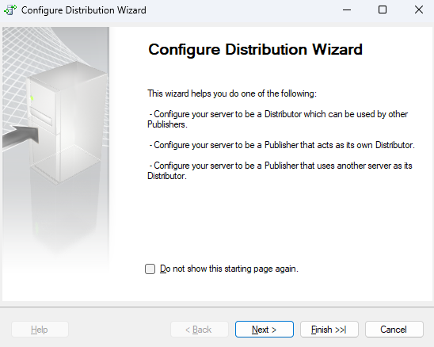
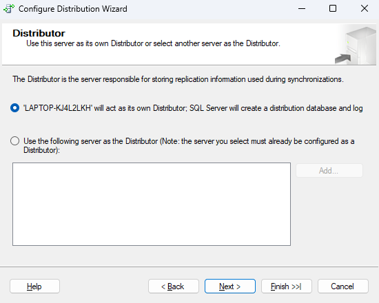
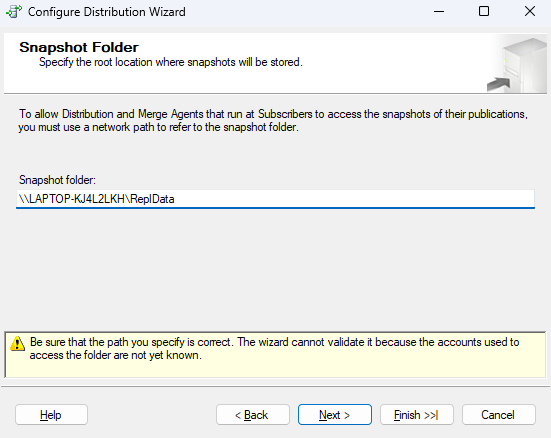
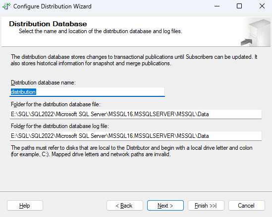
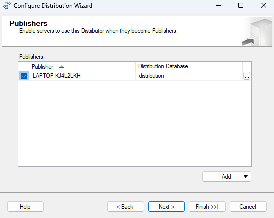
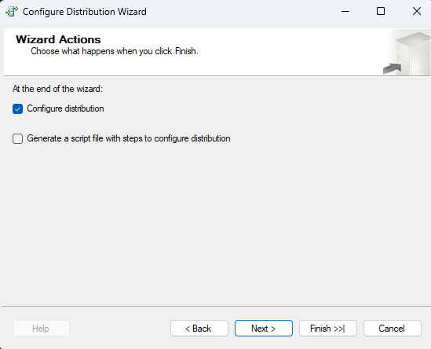
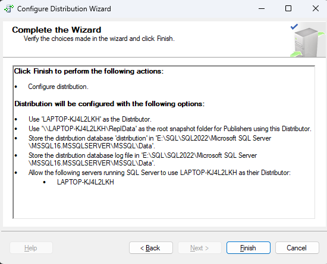
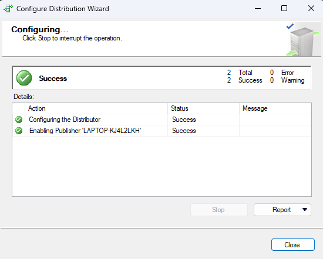

## [Cấu hình phân tán](#cấu-hình-phân-tán)

### **Yêu cầu:** [Chuẩn bị](../Prepare/README.md)

1. Trong Microsoft SQL Server Management Studio, kết nối với server sẽ là một `Distributor` (trong nhiều trường hợp, `Publisher` và `Distributor` là cùng một server), sau đó mở rộng nút máy chủ (server node).

2. Bấm chuột phải vào thư mục `Replication` rồi bấm `Configure Distribution`.

    

3. Cấu hình theo hướng dẫn sau:

    - Chọn `Distributor`. Để dùng `local Distributor`, chọn `'LAPTOP-KJ4L2LKH' will act as its own Distributor; SQL Server will create a distribution database and log.`

    - Để sử dụng `remote Distributor`. Chọn `Use the following server as the Distributor, and then select a server. The server must already be configured as a Distributor, and the Publisher must be enabled to use the Distributor`.

        

    - Nếu bạn chọn `remote Distributor`, bạn phải nhập mật khẩu trên trang `Administrative Password` cho các kết nối được thực hiện từ `Publisher` đến `Distributor`. Mật khẩu này phải trùng với mật khẩu được chỉ định khi kích hoạt `Publisher` tại `remote Distributor`.

    - Chỉ định thư mục `snapshot` (dành cho `local Distributor`). Thư mục `snapshot` chỉ đơn giản là một thư mục mà bạn đã chỉ định làm nơi chia sẻ; tác nhân đọc và ghi vào thư mục này phải có đủ quyền truy cập vào nó. Mỗi `Publisher` sử dụng `Distributor` này sẽ tạo một thư mục trong thư mục gốc và mỗi ấn phẩm sẽ tạo các thư mục trong thư mục `Publisher` để lưu trữ các `snapshot files`.

        

    - Chỉ định cơ sở dữ liệu phân tán (đối với `Distributor`). Cơ sở dữ liệu phân tán lưu trữ `metadata` và dữ liệu lịch sử cho tất cả các `replication and transactions` để sao chép giao dịch.

        

    - Tùy chọn cho phép các `Publisher` khác sử dụng `Distributor`. Nếu các `Publisher` khác được phép sử dụng `Distributor`, bạn phải nhập mật khẩu trên trang `Distributor Password` cho các kết nối được thực hiện từ các `Publisher` này đến `Distributor`.

        

    - Tùy chọn cài đặt cấu hình tập lệnh. Để biết thêm thông tin, hãy xem Sao chép tập lệnh.

        

        

        

