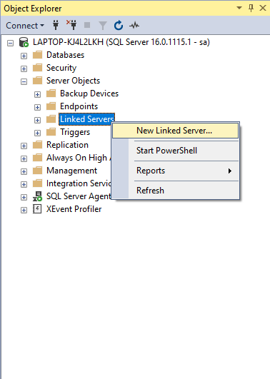
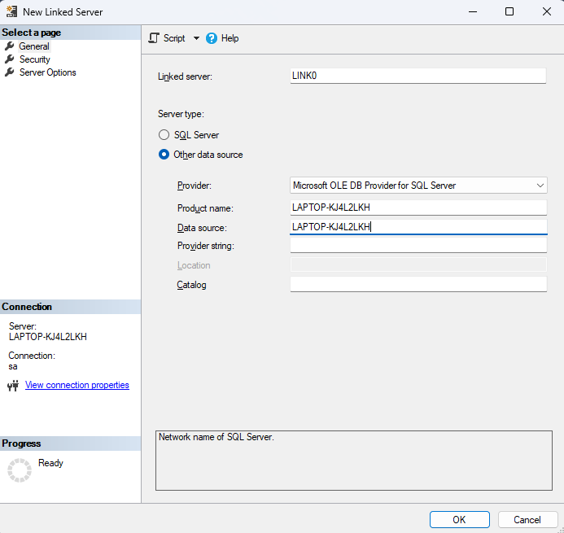
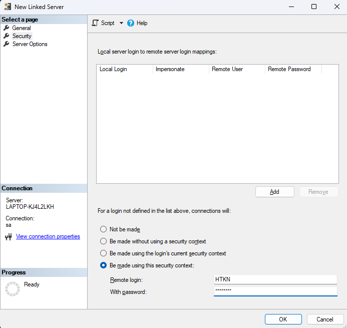

# [Create Linked Servers](#create-linked-servers)

### Chuẩn bị: [Hướng dẫn tạo login](../Create-Login/README.md)

Tạo một login tại server remote(Server muốn link tới) với:

- **[Login](#login)**: HTKN

- **[Password](#password)**: 12345

### Create Link server

1. Mở server để link -> mở rộng `Server Objects` -> chuột phải vào thư mục `Linked Servers` -> chọn `New Linked Servers`.

    

2. Ô `Linked serve`” nhập tên của linked server.

3. Server type:
    
    - Product: tên của server bạn muốn link tới.
    
    - Data source: tên của server bạn muốn link tới.

        

4. Chuyển sang tab `Security`. Chọn `Be made using this security context`.

    - Remote login: [Login đã tạo ở trên](#login)

    - With Password: [Password đã tạo ở trên](#password)

    

5. Chọn OK.