# [Create new publication](#create-new-publication)

Tạo `Publication` mới và định nghĩa các `articles` bằng `New Publication Wizard`. Sau khi một `Publication` được tạo, xem và chỉnh sửa các thuộc tính `Publication` trong hộp thoại `Publication Properties`.

### Tạo mới `Publication` và định nghĩa các `articles`

1. Kết nối vào `Publisher` trong Microsoft SQL Server Management Studio, và mở rộng `server node`.

2. Mở rộng thư mục `Replication` và nhấn chuột phải vào thư mục `Local Publications`.

3. Chọn `New Publication`.

    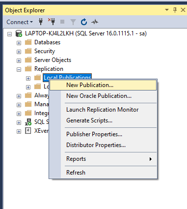

4. Tạo theo hướng dẫn dưới đây.

    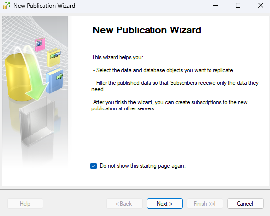

    

    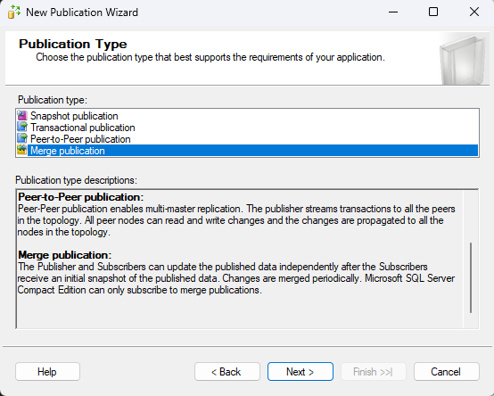

    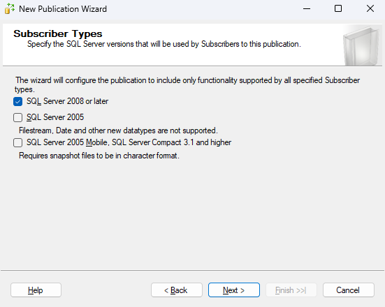

    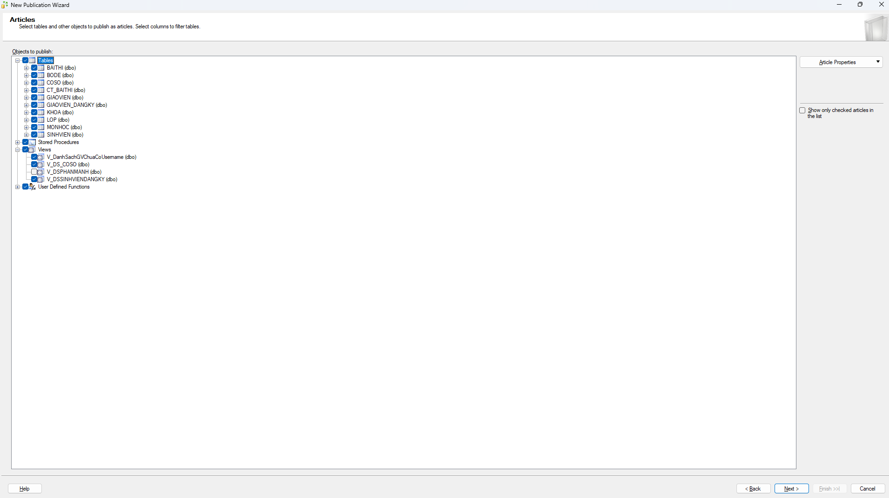

    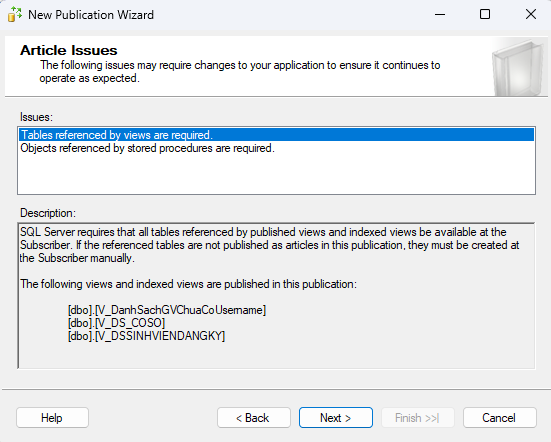

    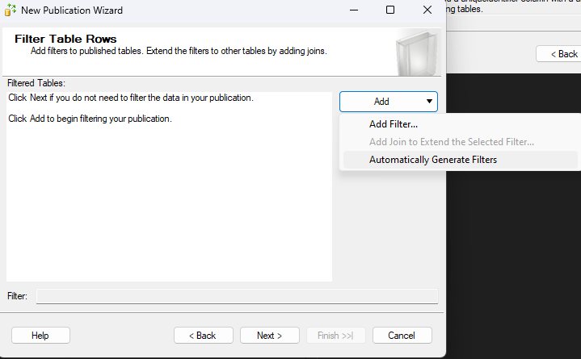

    

    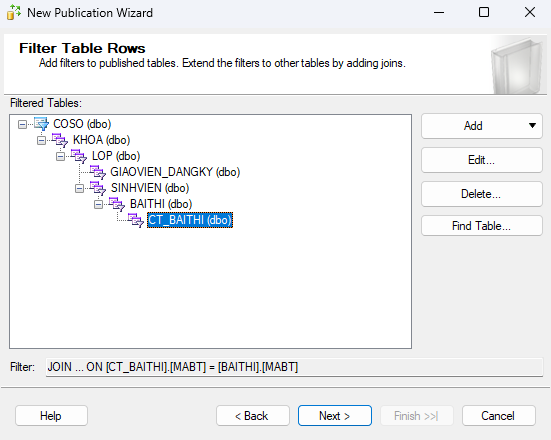

    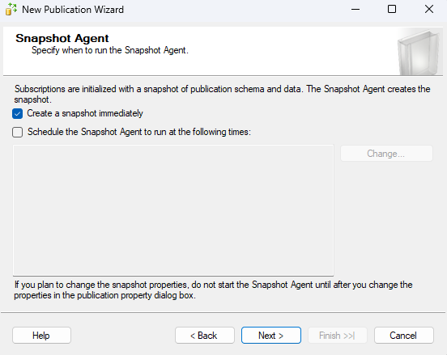

    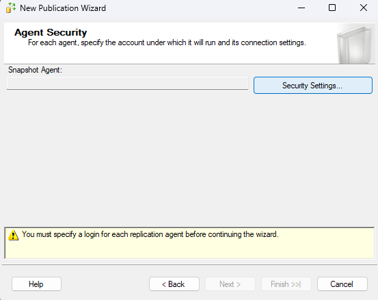

    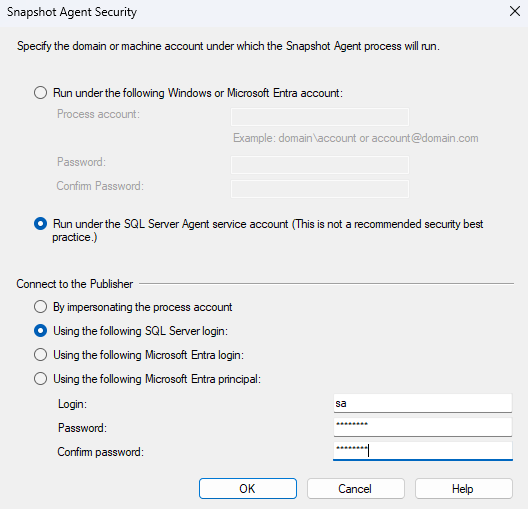

    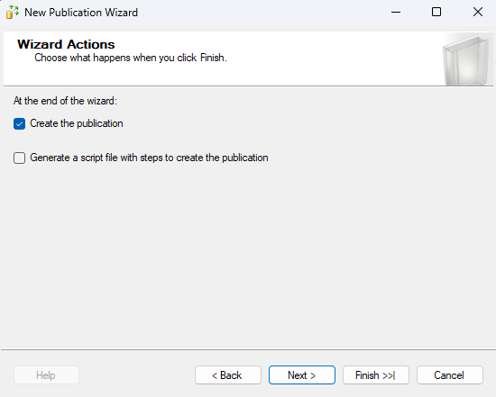

    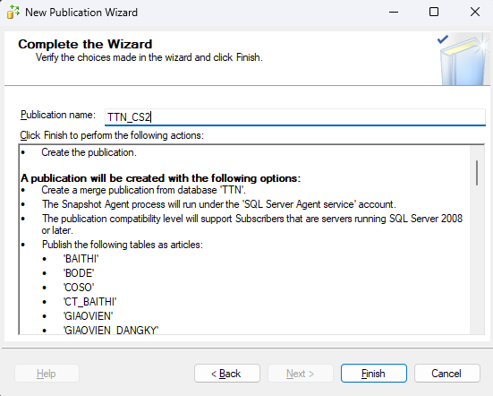

    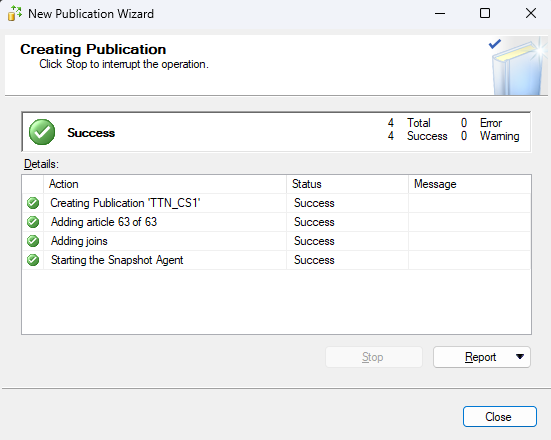