# [Create subscription](#create-subscription)

### Yêu cầu: 

- [Cấu hình](../Configure-Distribution/README.md)

- [Phân tán](../Create-new-Publication/README-TTN-CS1.md)

### Tạo `Subscriber`

1. Mở rộng thư mục `Replication` -> Mở rộng thư mục `Local Publications` -> Chuột phải vào 1 `Publication` muốn đẩy xuống -> Chọn `New Subscriptions`

    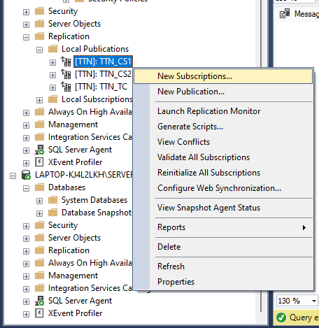

    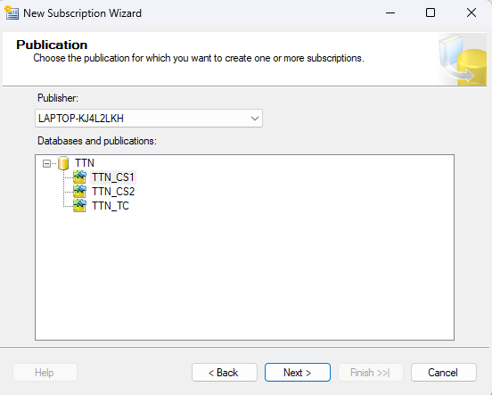

2. Chọn `Next`.

    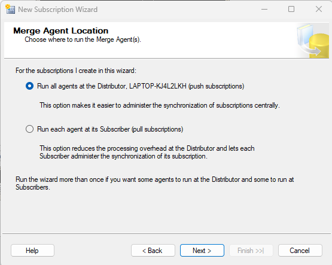

3. Chọn `Next`-> Chọn nút `Add SQL Server Subscriber` -> Chọn 1 Server để làm nơi chứa dữ liệu (ví dụ ở đây là `SERVER1`)

    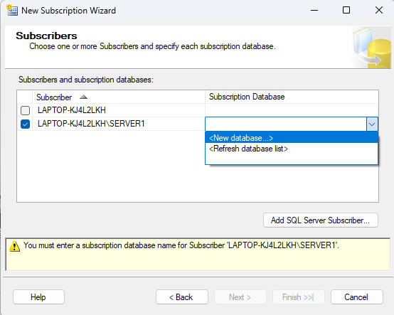

    - Chọn `<New database>`.

    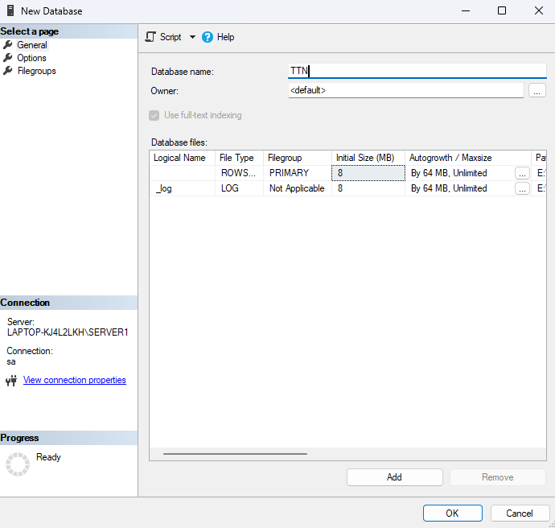

    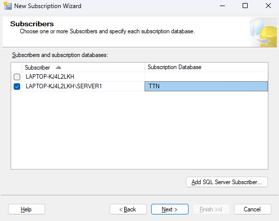

    - Chọn nút `...`.

    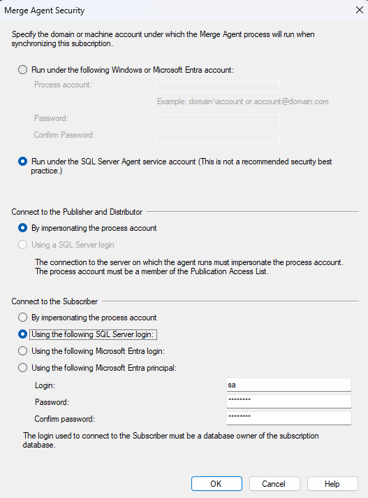

    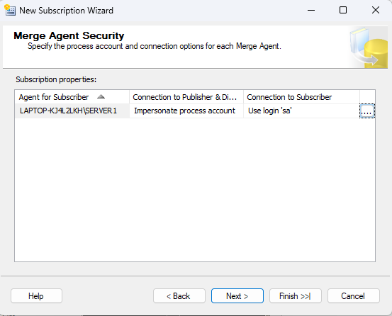

    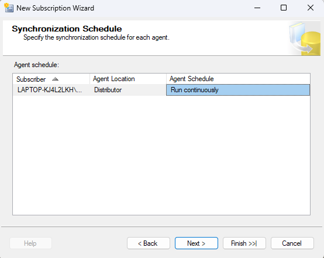
    
    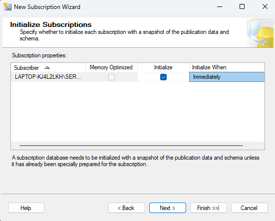

    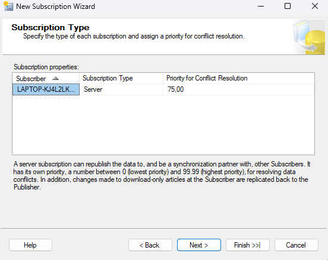

    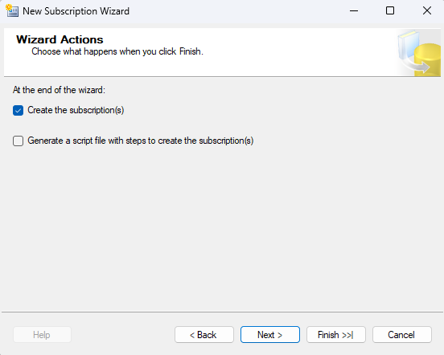

    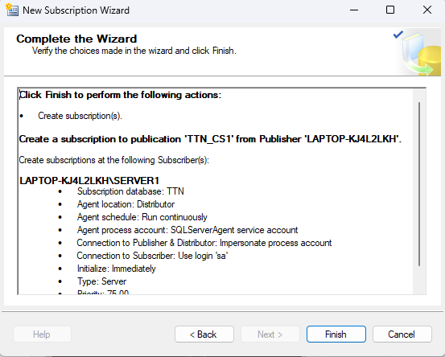