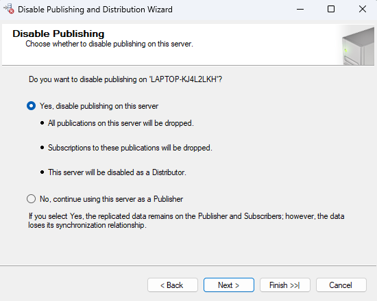
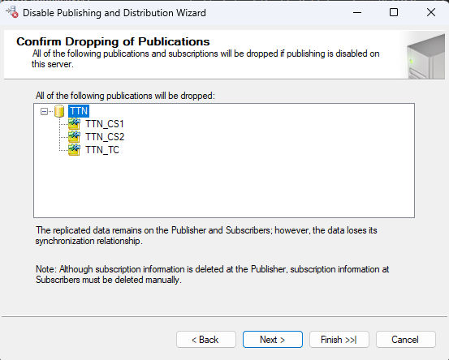
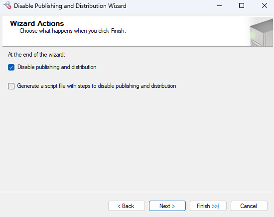
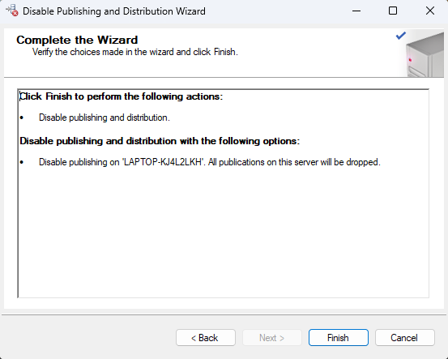

# [Disable Publishing and Distribution](#disable-publishing-and-distribution)

### Để disable các Server Publisher và Distributor, ta thực  hiện các bước :

1. Bấm chuột phải vào thư mục `Replication` rồi bấm `Disable Publishing and Distribution...`.

    

2. Chọn `Yes, disable publishing on this server`. Chọn `Next`.

    

3. Chọn `Next`.

    

3. Chọn `Next`.

    

4. Chọn `Finish`.