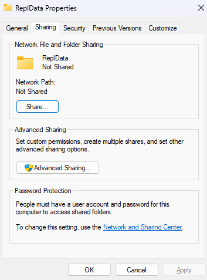
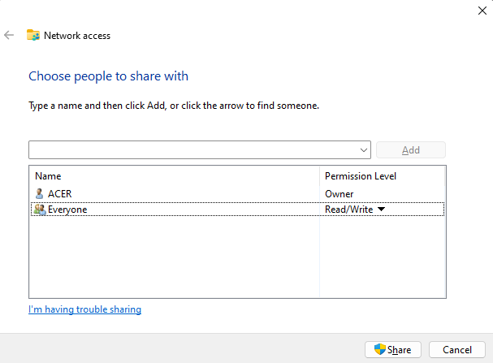
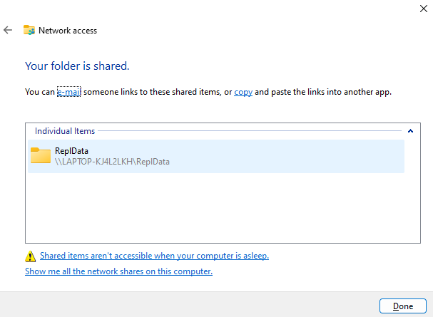

## [Chuẩn bị](#chuẩn-bị)

1. Ta tạo 1 folder `E:\SQL\ReplData` *(Bạn có thể tạo 1 folder với đường dẫn khác)* để chứa các dữ liệu trao đổi trong quá trình update dữ liệu từ các phân mảnh về cơ sở dữ liệu gốc, và từ cơ sở dữ liệu gốc đến các phân mảnh

2. Tiến hành cho folder này là 1 snapshot folder: thực chất là 1 shared folder trong Windows, cho phép các users được quyền read/write (giả sử shared folder có tên `\\LAPTOP-KJ4L2LKH\ReplData`)
Right click trên folder REPLDATA, chọn Properties, chọn tab Sharing – Share

    

    

3. Chọn Everyone, click Add, và chọn quyền Read/Write như trong hình. Cuối cùng, click nút lệnh Share.

     

    
